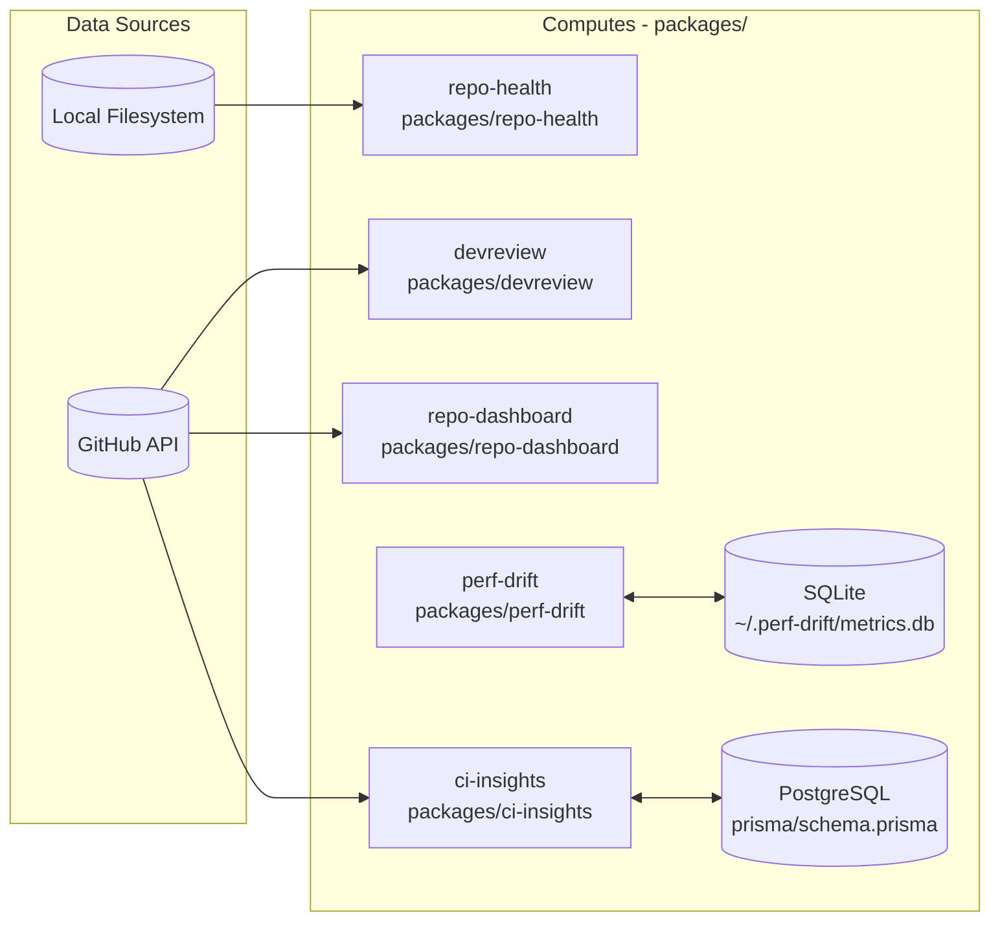

# Architecture

How the repo-intelligence packages relate to each other and to the sibling products depsight and agent-ops-dashboard.

The five packages split into CLI tools that compute signals directly from a repository or the GitHub API, and a Next.js analytics service (`ci-insights`) that ingests GitHub Actions run history, stores it, and exposes it over an HTTP API.

## Relation to depsight and agent-ops-dashboard

These three products overlap in spirit but solve different problems:

- [depsight](https://github.com/LanNguyenSi/depsight) is the deployed CVE and dependency-health product: one main question ("am I shipping known-vulnerable code?") answered well, with its own GitHub Actions sync for CI health. It is a separate repository, not a package of this monorepo.
- [agent-ops-dashboard](https://github.com/LanNguyenSi/agent-ops-dashboard) is the cross-repo operational view: a live fleet dashboard for many repositories at once.
- repo-intelligence is the toolkit layer: the CLIs and scorers (`repo-health`, `ci-insights`, `devreview`, `perf-drift`, `repo-dashboard`) that compute repository signals. The three are independent: depsight and agent-ops-dashboard compute their own signals from the GitHub API and do not read repo-intelligence output.

## Workspace layout

There is no root `package.json` and no npm workspace. Each `packages/<name>` directory has its own `package.json`, lockfile, and tooling, and is installed, built, and tested independently; the CI matrix in `.github/workflows/ci.yml` runs one job per package.
